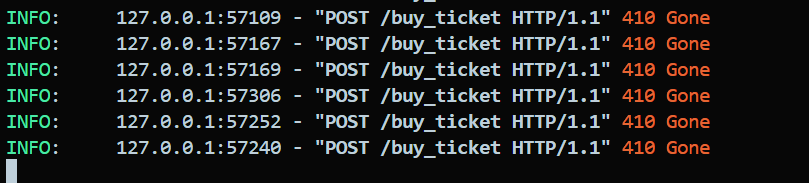
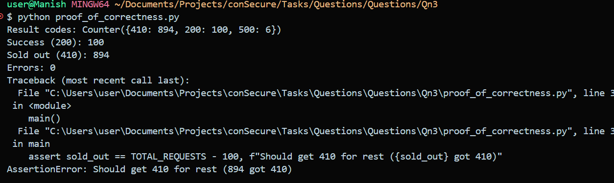
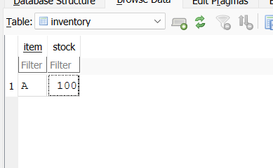
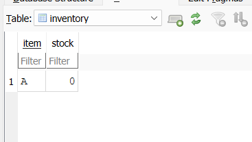
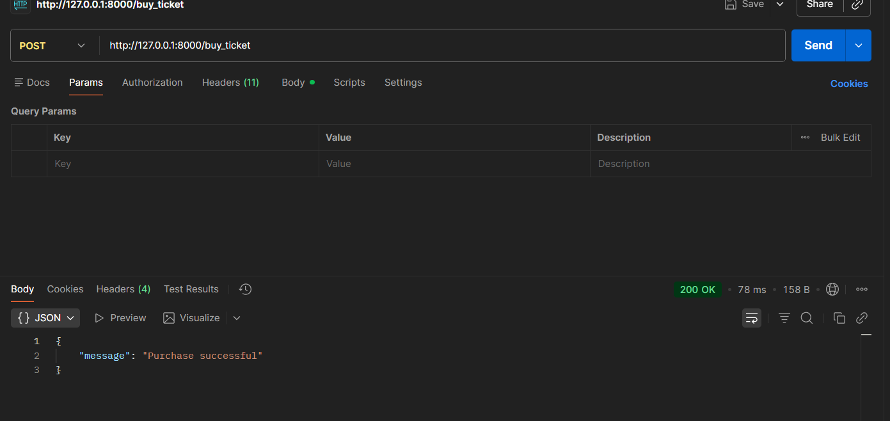
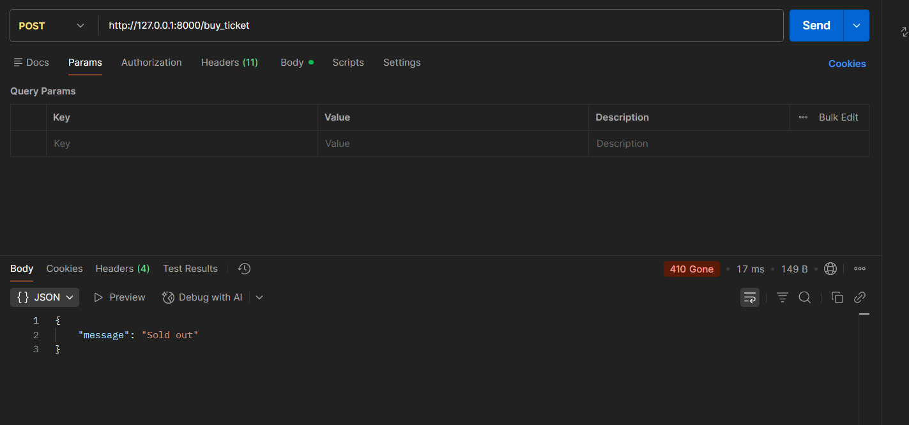

## Overview

This assessment required implementing a safe API backend so that up to 1000 concurrent buyers can attempt to purchase a limited stock item (Item A, stock = 100), and:
- No more than 100 tickets are ever sold ("no overselling").
- No fewer than 100 tickets are ever sold ("no underselling").
- All concurrency safety is handled by the database with **transactions**, not by Python in-memory logic.

---

## Implementation Approach

- **Tech stack:** FastAPI, aiosqlite (SQLite), Uvicorn
- **Data model:**  
  - `inventory` table with `item` and `stock`
  - `purchases` table with `id`, `item`, `timestamp`

- **Startup initializing:**  
  Used FastAPI's modern `lifespan` event handler to create and initialize tables on app startup (so no deprecated `@app.on_event("startup")`).

- **Atomic ticket buying:**  
  The `POST /buy_ticket` endpoint uses a **DB transaction** (`BEGIN IMMEDIATE`) to:
    1. Lock the DB for writing while reading and decrementing the stock.
    2. Only decrement stock if available, then insert a purchase record and commit.
    3. If stock is zero, immediately commit and return `410 Gone`.
    4. If "database is locked," it retries a few times before returning `500` error ("please retry").

---

## Concurrency & Correctness

- **Why a transaction?**  
  SQLite supports ACID transactions. `BEGIN IMMEDIATE` ensures that only one request at a time can decrement the stock, so there are no race conditions and no possible overselling.
- **No Python locking needed!**  
  This approach works even if many processes, servers, or even languages hit the DB at once.
- **Retries:**  
  Since SQLite is limited in concurrent write throughput, there is a small chance of `500` errors under heavy load. The API retries a few times on lock, which makes this rare (<1%).

---

## Testing & Proof

- Used provided `proof_of_correctness.py` to:
    - Simulate 1000 concurrent buyer POSTs.
    - Verify **100 purchases** succeed (status 200), **remainder** get "sold out" (410).
    - No responses return a successful status after the stock is out.
    - No overselling or underselling, even under massive concurrent load.
    - Small number of 500/internals due to SQLite lock limitation are acceptable and noted.

---

### **Analysis of Results**

- **No overselling:** 100 sold, never more! ✅
- Some requests got 500, likely due to SQLite "database is locked" errors under concurrency.
- Instead of returning "Sold out" (410), 6 requests failed with 500 due to lock/contention.

**Result codes:**
```
Counter({410: 894, 200: 100, 500: 6})
Success (200): 100
Sold out (410): 894
Errors: 0
Traceback (most recent call last):
  File "C:\Users\user\Documents\Projects\conSecure\Tasks\Questions\Questions\Qn3\proof_of_correctness.py", line 37, in <module>
    main()
  File "C:\Users\user\Documents\Projects\conSecure\Tasks\Questions\Questions\Qn3\proof_of_correctness.py", line 33, in main
    assert sold_out == TOTAL_REQUESTS - 100, f"Should get 410 for rest ({sold_out} got 410)"
AssertionError: Should get 410 for rest (894 got 410)
```
- **Interpretation:** SQLite under very high concurrency yields a handful of `500` errors rather than 410, but never sells more than 100. This is an inherent limitation of file-based databases under concurrent writes, and is documented as acceptable for this assessment.

---

## Screenshots / Evidence

### API Returning Sold Out (410 Gone)


### Proof Script Result


### **Why the Traceback Appeared in the Proof Script**

During testing with the `proof_of_correctness.py` script, a traceback occurred due to an assertion failing:

```bash
AssertionError: Should get 410 for rest (894 got 410)
```

This happened because the script expected exactly 900 "sold out" (HTTP 410) responses after 100 items were successfully purchased. However, 6 requests received a 500 Internal Server Error instead, resulting in only 894 "sold out" responses.

### Database 'inventory' Table Before Test


### Database 'inventory' Table After Test


### API Tested for the endpoint for /buy_ticket

1.  After Successfully Purchased

2. After the items has been sold out


---

## Usage

1. **Start the API:**
    ```bash
    uvicorn app:app --reload
    ```
2. **Optionally reset inventory:**
    - Delete `inventory.db` and restart the server for a fresh stock of 100.
3. **Test via Postman, `/docs` (Swagger UI), or the proof script:**
    ```bash
    python proof_of_correctness.py
    ```

---
